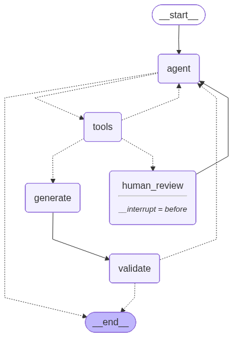

# Data Contract Agent

> A conversational CLI agent that generates valid **DPCS 1.1.0 data contracts** from natural language — powered by LangGraph with real human-in-the-loop interrupts.

Built as a standalone learning project to explore LangGraph's agent architecture, tool calling, state management, and graph interruption patterns — grounded in a real industrial use case from the circular economy domain for manufacturing SMEs.

---

## What It Does

You describe a data sharing scenario in plain language. The agent guides you through a structured conversation, calls tools to build up the contract state, pauses for your confirmation before generating, and produces a valid YAML file ready to load into any DPCS-compatible platform.

```
You: Acme GmbH wants to share product and material data with a research university.

Agent: Got it. What is the data steward email for Acme GmbH?

You: data@acme-gmbh.de

...

[INTERRUPT] Graph paused for your confirmation.
You: yes

→ acme_gmbh_datacontract.yaml saved.
```

---

## Architecture



```
START
  │
  ▼
agent_node  ←─────────────────────────────────────────┐
  │                                                    │
  ├─ tool calls? ──► tools_node                        │
  │                      │                             │
  │                      ├─ phase == "reviewing"       │
  │                      │       ▼                     │
  │                      │  human_review ⏸             │  ← interrupt
  │                      │  (summary confirm)          │
  │                      │       │                     │
  │                      └─ phase == "generating" ─────┤
  │                                ▼                   │
  │                          generate_node             │
  │                                ▼                   │
  │                          validate_node             │
  │                           /        \               │
  │                        valid      invalid          │
  │                          │           └─────────────┘
  │                          ▼
  └─ no tool calls? ──► END
```

**4 nodes:**

- `agent_node` — calls the LLM with all tools bound, routes based on tool calls
- `tools_node` — executes tool calls, updates state via `Command` pattern
- `generate_node` — pure Python YAML generation from collected state
- `validate_node` — schema and logic validation, loops back on errors

**1 interrupt point** via `interrupt_before=["human_review"]`:

- Summary confirmation — graph pauses before generating YAML, user reviews and approves

---

## Key LangGraph Concepts Demonstrated

| Concept | Where |
|---|---|
| `TypedDict` state with reducers | `state.py` — `add_messages` and custom `replace` reducer |
| `Command` pattern for state updates | `tools.py` — every tool writes directly to state |
| `InjectedState` and `InjectedToolCallId` | `tools.py` — tools read state and link tool call IDs |
| Conditional edges driven by `phase` field | `agent.py` — `route_from_agent`, `route_from_tools` |
| `interrupt_before` human-in-the-loop | `agent.py` — `MemorySaver` + `interrupt_before=["human_review"]` |
| Graph resume with `update_state` + `invoke(None)` | `main.py` — interrupt handling loop |

---

## Project Structure

```
contract-agent/
├── state.py                  # ContractState TypedDict — single source of truth
├── prompts.py                # System prompt for the agent
├── tools.py                  # 6 tools: save_partner_info, add_model,
│                             #   suggest_quality_rules, add_consumer,
│                             #   show_summary, finalize_contract
├── agent.py                  # Graph assembly — nodes, edges, compile
├── generator.py              # generate_contract_yaml(state) → YAML string
├── validator.py              # validate_contract(yaml_str) → list[str]
├── main.py                   # CLI conversation loop with interrupt handling
├── contract/
│   └── data_contract_template.yaml   # Predefined model library (12 models)
├── docs/
│   └── graph.png             # Graph visualization — commit this file
├── .env.example              # Environment variable template
└── requirements.txt
```

---

## Quick Start

```bash
git clone https://github.com/Amirshirazi-tech/contract-agent
cd contract-agent

pip install -r requirements.txt

cp .env.example .env
# Edit .env and add your API key
```

Edit `.env`:

```
MODEL_BACKEND=openrouter
OPENROUTER_API_KEY=sk-or-...
```

Run:

```bash
python main.py
```

---

## Model Backends

The agent is fully model-agnostic. Switch by changing `MODEL_BACKEND` in `.env`:

| Backend | Model | Cost | Notes |
|---|---|---|---|
| `openrouter` | `anthropic/claude-haiku-4.5` | ~€0.001/run | Recommended — reliable tool calling |
| `anthropic` | `claude-haiku-4-5` | ~€0.001/run | Direct Anthropic API |
| `ollama` | `llama3.1:8b` | Free | Local — tool calling less reliable |

---

## Predefined Model Library

The agent loads these models automatically from `contract_template.yaml` — no field definition needed:

`product` · `material` · `order` · `energy_consumption` · `scope1_fuel` · `scope2_electricity` · `scope3_material` · `scope3_transport` · `pcf_aggregation` · `digital_product_passport`

For any model not in this list, the agent detects it as a custom model and collects field definitions through conversation.

---

## Example Output

```yaml
dataContractSpecification: 1.1.0
id: acme_gmbh_datacontract
info:
  title: Acme GmbH – Data Contract
  version: 1.0.0
  owner: Acme GmbH
  status: draft
  contact:
    email: data@acme-gmbh.de
servers:
  production:
    type: kafka
    host: broker.example.com:9092
    topics:
      - platform.acme_gmbh.product
      - platform.acme_gmbh.material
    format: json
    security: SASL_SSL
models:
  product:
    topic: platform.acme_gmbh.product
    kg_node: Product
    required: [product_id, batch_id, material_no]
    fields:
      product_id:
        type: string
        description: Unique product identifier
      ...
terms:
  license: CC-BY-NC-4.0
  compliance: [GDPR, IDS_Usage_Control]
```

---

## The Human-in-the-Loop Pattern

This is the core LangGraph concept this project demonstrates. When `show_summary` fires and sets `phase = "reviewing"`, the graph physically stops:

```python
# Graph compiles with interrupt
app = graph.compile(
    checkpointer=MemorySaver(),
    interrupt_before=["human_review"]
)

# First invoke — runs until human_review, then pauses
app.invoke(state, config)

# Inspect frozen state
snapshot = app.get_state(config)

# User confirms — inject response and resume
app.update_state(config, {"messages": [HumanMessage(content="yes")]})
app.invoke(None, config)  # None = resume, no new input
```

This is architecturally different from the LLM simply asking "does this look right?" — the graph state is saved to the checkpointer, external systems can inspect or modify it, and resumption is explicit. In a production system this pause point could trigger a Slack notification, a web UI approval button, or a manager review workflow.

---

## Requirements

```
langgraph>=0.2.28
langchain-anthropic>=0.3.0
langchain-openai>=0.2.0
langchain-ollama>=0.2.0
langchain-core>=0.3.0
pyyaml>=6.0.1
python-dotenv>=1.0.0
rich>=13.0.0
```

---

## Background

This agent was built as a learning project to understand LangGraph from first principles — writing every node, edge, and routing function manually rather than using higher-level abstractions.

The predefined model library covers EU Digital Product Passport (ESPR), GHG Protocol Scope 1/2/3, ISO 14067 PCF, and ISA-95 production data — grounded in CEON, DPPO, MatOnto, and GHG Protocol ontologies.

---

## Author

**Dr. Amir Noori Shirazi**  
Data Architect & Software Development Lead  
[LinkedIn](https://www.linkedin.com/in/amirnoorishirazi) · [GitHub](https://github.com/Amirshirazi-tech)
